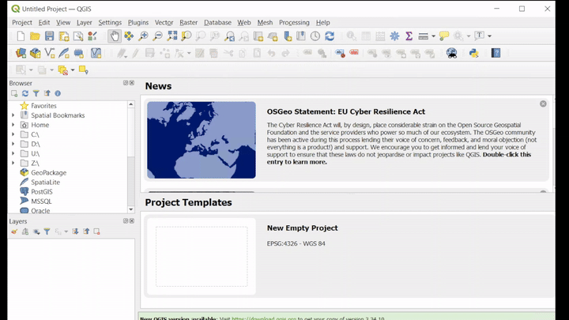

# TreeEyed
A QGIS plugin for tree monitoring using AI.

## Features
This plugins seeks to integrate existing and custom AI models for tree monitoring (semantic segmentation, instance segmentation, and object detection) in **high resolution RGB imagery**.

Apart from the model handling this plugin facilitates the integration with QGIS layers for image extraction and post-processing. Additional features for dataset creation and validation in COCO format are available. 

| Model               | Source                                                  | Preferred spatial resolution |
|---------------------|---------------------------------------------------------|------------------------------|
| HighResCanopyHeight | https://github.com/facebookresearch/HighResCanopyHeight | 1 m                          |
| Mask R-CNN          | Custom trained                                          | 4.77 m                       |
| Deepforest          | https://github.com/weecology/DeepForest                 | less than 0.5 m              |

## Installation

TreeEyed plugin is now available directly in the [QGIS Python Plugins Repository](https://plugins.qgis.org/plugins/tree_eyed/) and can be installed using the plugin manager in QGIS.

## Documentation

Documentantion and tutorials are available [here](https://treeeyed.readthedocs.io/en/latest/).

## Requirements

This plugin works on QGIS, and it was tested on Windows using QGIS 3.28.9-Firenze.

It requires additional python packages that can be installed by using the plugin and following the installation instructions:

* rasterio
* pycocotools
* torch
* torchvision
* opencv-python
* deepforest

A **dependencies** folder with the required packages will be added in the plugin root folder.

## License
This repository is licensed under the Apache 2.0 license.

## Authors
Andrés Felipe Ruiz-Hurtado, Tropical Forages - CIAT

<!-- ## TODO -->

<!-- ## Citation -->

