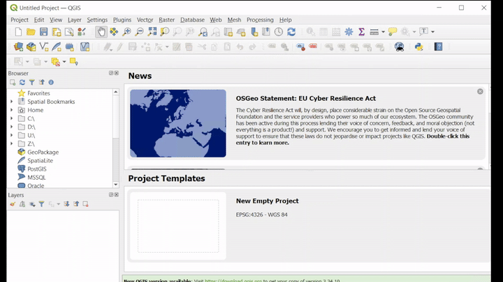

<p align="center">
  
  <h1 align="center">TreeEyed QGIS Plugin version 0.2.0</h1>
  <p align=center><a href="https://github.com/afruizh/TreeEyed/releases/tag/v0.2.0-experimental">Download experimental release</a></a>
  <p align=center><a href="https://treeeyed.readthedocs.io/en/latest/">Documentation</a></a>
  <p align=center><a href="https://treeeyed.readthedocs.io/en/latest/">Discord</a></a>
</p>


A QGIS plugin for tree monitoring using AI.

[](https://youtu.be/QnMAEX6qkGU "Simple Inference")


## Features
This plugins seeks to integrate existing and custom AI models for tree monitoring (semantic segmentation, instance segmentation, and object detection) in **high resolution RGB imagery (meters per pixel)**.

Apart from the model handling this plugin facilitates the integration with QGIS layers for image extraction and post-processing. Additional features for dataset creation and validation in COCO format are available. 

Available models:

| Model               | Source                                                  | Preferred spatial resolution | Computer Vision Task  | Model exported in ONNX format |
|---------------------|---------------------------------------------------------|------------------------------|-----------------------|-------------------------------|
| HighResCanopyHeight | https://github.com/facebookresearch/HighResCanopyHeight | 1 m                          | Pixel-wise Regression | [link](https://drive.google.com/drive/folders/1diJ5so9FjwFi45phV-NOnuuL_6Xdx80x?usp=drive_link)|
| Mask R-CNN          | Custom trained                                          | 4.77 m                       | Instance Segmentation | [link](https://drive.google.com/file/d/1JhpsEjglsmmlN0kNCRqp1xAXohUCc4Xm/view?usp=drive_link)
| Deepforest          | https://github.com/weecology/DeepForest                 | less than 0.5 m              | Object Detection      | [link](https://drive.google.com/file/d/17cpB49Sy1GNmkhFgSsuyRT_4Yx44nI0W/view?usp=drive_link)
| VHRTrees            | https://github.com/RSandAI/VHRTrees                     | 0.5 m              | Object Detection      | [link](https://drive.google.com/file/d/1cjrwD6SekWgXEhOGF9bRQuQ721_BKOEJ/view?usp=drive_link)


## Installation

TreeEyed plugin is now available directly in the [QGIS Python Plugins Repository](https://plugins.qgis.org/plugins/tree_eyed/) and can be installed using the plugin manager in QGIS.




## Documentation

Documentantion and tutorials are available [here](https://treeeyed.readthedocs.io/en/latest/).

## Requirements

This plugin works on QGIS, and it was tested on **Windows 11** using **QGIS 3.40.0-Bratislava**.

It requires additional python packages that can be installed by using the plugin and following the installation instructions:

* rasterio
* pycocotools
* opencv-python
* onnxruntime-gpu

A **dependencies** folder with the required packages will be added in the plugin root folder.

## Troubleshooting

If you encounter issues while using the TreeEyed plugin, consider the following steps:

- **Plugin not loading:** Ensure you are using a compatible QGIS version.
- **Missing dependencies:** Check that all required Python packages are installed. Use the plugin's installation instructions to install missing packages.
- **Model loading errors:** Verify that the ONNX model files are correctly downloaded and placed in the expected directories.
- **Image processing issues:** Confirm that your input imagery matches the required spatial resolution for the selected model.
- **General errors:** Review the QGIS Python Console for error messages and consult the [documentation](https://treeeyed.readthedocs.io/en/latest/) for further guidance.

For unresolved issues, please open an issue on the [GitHub repository](https://github.com/your-repo/treeeyed/issues) with detailed information about your problem.

## Command Line Interface

To use TreeEyed functionality in CLI mode you need to create a python environment using:

```
conda create -n tree_eyed_env python=3.12
conda activate tree_eyed_env
pip install --no-cache-dir -r requirements.txt
```

```
conda install conda-forge::cudnn
conda install conda-forge::libcufft
conda install conda-forge::cuda-cudart
```

Additionally, you need to have the models in a local folder an a configuration file, for example a minimal configuration file `example_config.json` is:

```
{
	"model": "HighResCanopyHeight"
	, "model_dir": "path/to/models"
	, "output_path": "path/to/output/folder"
	, "prefix": "output_name"
	, "input_raster_path": "path/to/input/raster"
	, "task": "inference"
	, "raster_outputs": ["grayscale"]
	, "vector_outputs": []
}
```


```
python src/tree_eyed/tree_eyed_app.py --config config.json 
```


## Docker image

You can also use TreeEyed 

```
docker build -t treeeyed-image .
```


```
docker run --gpus all -v D:/local_mydata/treeeyed_tests/docker:/app/data -v D:/local_mydata/models/treeeyed2:/app/models -it treeeyed-image
```

```
python src/tree_eyed/tree_eyed_app.py --config /app/data/example_01.json 
```

## Updates

### V0.2.0

- [X] Migration to ONNX format and ONNX runtime for all modles
- [X] Reduced dependencies installation, improved installation feedback
- [X] Added VHRTrees Model
- [X] Added Custom ONNX model
- [X] Added h_mean, h_min and h_max columns when using HighResCanopyHeight for vector output
- [X] Improved layers visualization using Viridis color palette
- [X] Automatic tiling (tiling, processing, merging)
- [X] Cache System
- [X] Update GUI and look-and-feel
- [X] Added "Simple Inference" QGIS processing algorithm
- [X] Improved processing architecture (interface, processor, tree_eyed_processor)
- [X] Added CLI using `tree_eyed_app.py`
- [X] Added docker support using `Dockerfile`
- [X] Improved export to COCO dataset
- [X] Support for non tif images
- [X] Additional postprocessing steps (non-max supression)


## Roadmap

Planned improvements for TreeEyed include:

- [ ] Integration of additional AI models for tree monitoring.
- [ ] Support for state-of-the-art models such as DinoV3.
- [ ] Tree zonification features for spatial analysis.
- [ ] Carbon stock estimation tools.

Stay updated with progress and new features in the [documentation](https://treeeyed.readthedocs.io/en/latest/) and on the [GitHub repository](https://github.com/your-repo/treeeyed).

## License
This repository is licensed under the Apache 2.0 license.

## Contribution

We welcome contributions from the community! If you would like to contribute to TreeEyed, please follow these steps:

1. Fork the repository and create your branch from `experimentalv0.2`.
2. Make your changes and ensure code quality and documentation.
3. Submit a pull request with a clear description of your changes.

For major changes, please open an issue first to discuss your proposed modifications.

TODO

~~See the [CONTRIBUTING.md](CONTRIBUTING.md) file for detailed contribution guidelines.~~


## Acknowledgment

This work is being carried out as part of the CGIAR Initiatives and Funded Projects. CGIAR is a global research partnership for a food-secure future. Its science is carried out by 15 Research Centers in close collaboration with hundreds of partners across the globe.

TreeEyed is an open source project, and we welcome contributions and feedback from the community.  
We would like to extend our gratitude to the developers and maintainers of the libraries and models integrated into this plugin:

* [HighResCanopyHeight](https://github.com/facebookresearch/HighResCanopyHeight)
* [DeepForest](https://github.com/weecology/DeepForest)
* [VHRTrees](https://github.com/RSandAI/VHRTrees)

## Authors


Tropical Forages Progam

Alliance Bioversity International & CIAT

<!-- ## TODO -->

## Research

A. F. Ruiz-Hurtado, J. P. Bolaños, D. A. Arrechea-Castillo, and J. A. Cardoso, ‘TreeEyed: A QGIS plugin for tree monitoring in silvopastoral systems using state of the art AI models’, SoftwareX, vol. 29, p. 102071, Feb. 2025, [doi: 10.1016/j.softx.2025.102071](https://www.sciencedirect.com/science/article/pii/S235271102500038X).

Citation (Bibtex format):

```
@article{ruiz-hurtadoTreeEyedQGISPlugin2025,
  title = {{{TreeEyed}}: {{A QGIS}} Plugin for Tree Monitoring in Silvopastoral Systems Using State of the Art {{AI}} Models},
  author = {{Ruiz-Hurtado}, Andres Felipe and Bola{\~n}os, Juliana Perez and {Arrechea-Castillo}, Darwin Alexis and Cardoso, Juan Andres},
  year = {2025},
  month = feb,
  journal = {SoftwareX},
  volume = {29},
  pages = {102071},
  issn = {2352-7110},
  doi = {10.1016/j.softx.2025.102071},
  keywords = {Computer vision,Deep learning,QGIS,Remote sensing,Silvopastoral systems,Tree monitoring},
}
```


