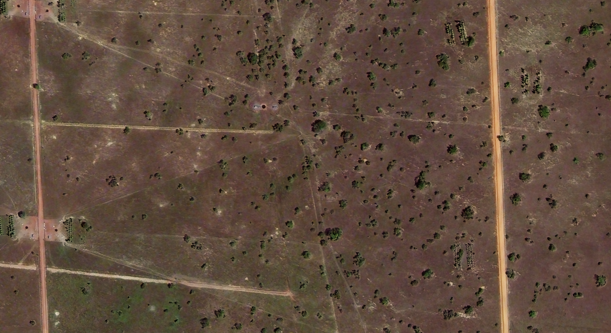

Inference using HighResCanopyHeight
===================================

**HighResCanopyHeight** is a **Regression Model**, it generates tree height maps. Using TreeEyed multiple relevant layers can be generated.

Direct result:

* Grayscale raster (tree heights)

Derived results:

* Binary raster (tree/non tree)
* Polygons vector layer
* Bounding Boxes vector layer
* Centroids vector layer

===================
Input
===================

.. .. image:: ../res/2-3-2023-crop1.png
..     :width: 500
..     :align: center

.. .. image:: ../res/2-3-2023-crop2.png
..     :width: 500
..     :align: center

.. .. image:: ../res/2-3-2023-crop3.png
..     :width: 500
..     :align: center

.. .. image:: ../res/2-3-2023-crop4.png
..     :width: 500
..     :align: center

For this example we will use this image of a silvopastoral system. This image was extracted from a bigger raster image.
In particular the important characteristic is:

.. csv-table:: Input image features
   :file: ../res/example_1.csv
   :align: center
   :header-rows: 1

.. .. list-table::
..    :widths: 25 25 25 25

..    * - .. image:: ../res/2-3-2023-crop1.png
..      - .. image:: ../res/2-3-2023-crop2.png
..      - .. image:: ../res/2-3-2023-crop3.png
..      - .. image:: ../res/2-3-2023-crop4.png

| The images can be downloaded here:

===================
Configuration
===================

Input
------

* Select the appropiate **Input layer** from the dropdown menu.
* For **Extent** select **Layer extent**.

Output
-------
* Select the appropiate **Output directory** and **Output name**.

Processing
----------

* Go to the **Inference** tab
   * Select **HighResCanopyHeight** model from the dropdown menu   
   * Select the desired **Result types**, the direct result type for this model is **Grayscale**
   * You can leave the default parameters or adjust them
      *type*: you can choose between Satellite or or Aerial for your corresponding input
      *theshold:* percentage of to threshold the result for the binay raster result
   * Press **Process** to start the inference process

===================
Results
===================

The resulting added layers depend on the selected **Result types**

.. .. list-table::
..    :widths: 25 25 25 25

..    * - .. image:: ../res/results_png/example_1_grayscale.png
..      - .. image:: ../res/2-3-2023-crop2.png
..      - .. image:: ../res/2-3-2023-crop3.png
..      - .. image:: ../res/2-3-2023-crop4.png

Direct result:

.. list-table::
   :widths: 30 30 40
   :header-rows: 1

   * - Processing Result
     - Result Type
     - Result
   * - **RASTER LAYERS**
     -
     -
   * - Derived result
     - Binary
     - .. image:: ../res/results_png/example_1_binary.png
   * - **Direct result**
     - Grayscale
     - .. image:: ../res/results_png/example_1_grayscale.png
   * - **VECTOR LAYERS**
     -
     -  
   * - Derived result
     - Polygons
     - .. image:: ../res/results_png/example_1_polygons.png   
   * - Derived result
     - Bounding Boxes
     - .. image:: ../res/results_png/example_1_bb.png
   * - Derived result
     - Centroids
     - .. image:: ../res/results_png/example_1_centroids.png 