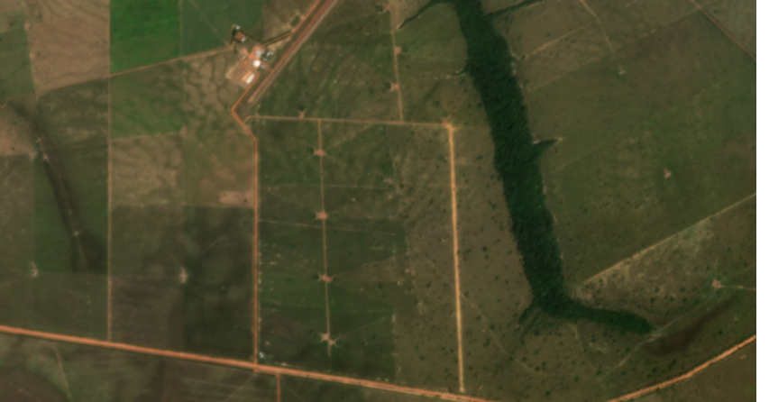

Inference using Mask-RCNN custom model
========================================

**Mask-RCNN** architecture can be used for multiple vision task. In this case it is used for **Instance Segmentation**.

Direct result:

* Binary raster (tree/non tree)

Derived results:

* Polygons vector layer
* Bounding Boxes vector layer
* Centroids vector layer

===================
Input
===================

For this example we will use this image of a silvopastoral system.

.. csv-table:: Input image features
   :file: ../res/example_2.csv
   :align: center
   :header-rows: 1

| The images can be downloaded `here <https://github.com/afruizh/TreeEyed/blob/documentation/examples/images/input_raster/example_2.tif>`_.

===================
Configuration
===================

Input
------

* Select the appropiate **Input layer** from the dropdown menu.
* For **Extent** select **Layer extent**.

Output
-------
* Select the appropiate **Output directory** and **Output name**.

Processing
----------

* Go to the **Inference** tab
   * Select **Mask-RCNN** model from the dropdown menu   
   * Select the desired **Result types**, the direct result type for this model is **Binary**
   * Press **Process** to start the inference process

===================
Results
===================

The resulting added layers depend on the selected **Result types**

.. .. list-table::
..    :widths: 25 25 25 25

..    * - .. image:: ../res/results_png/example_1_grayscale.png
..      - .. image:: ../res/2-3-2023-crop2.png
..      - .. image:: ../res/2-3-2023-crop3.png
..      - .. image:: ../res/2-3-2023-crop4.png

Direct result:

.. list-table::
   :widths: 30 30 40
   :header-rows: 1

   * - Processing Result
     - Result Type
     - Result
   * - **RASTER LAYERS**
     -
     -
   * - **Direct result**
     - Binary
     - .. image:: ../res/results_png/example_2_binary.png
   * - Derived result
     - Grayscale
     - NOT AVAILABLE FOR THIS MODEL
   * - **VECTOR LAYERS**
     -
     -  
   * - Derived result
     - Polygons
     - .. image:: ../res/results_png/example_2_polygons.png   
   * - Derived result
     - Bounding Boxes
     - .. image:: ../res/results_png/example_2_bb.png
   * - Derived result
     - Centroids
     - .. image:: ../res/results_png/example_2_centroids.png 