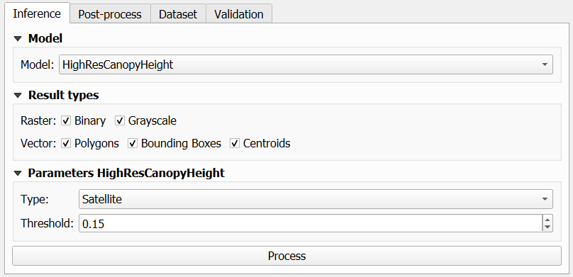
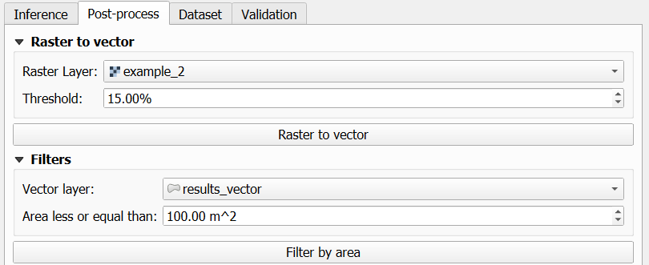
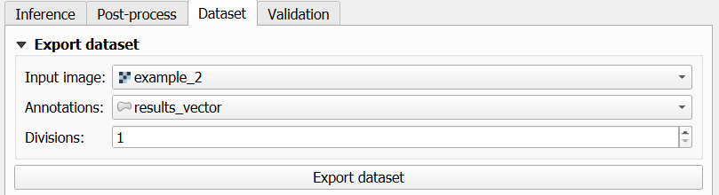
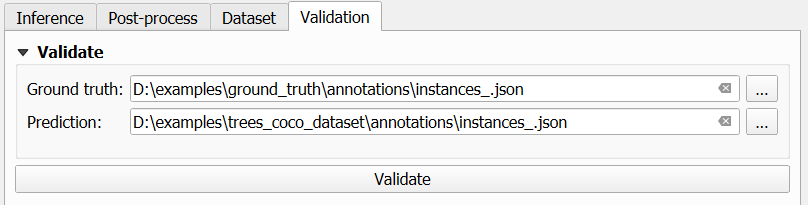

Features
============

===================
Inference
===================

The main processing available in the plugin is the infrerence. It is used to process the raster input files and generate the tree analysis output.

===================
Post-process
===================

This section can be used to applied additional post-processing for the results of the inference steps. For example converting raster to vector or filter vector instances by area.

===================
Dataset
===================

You can also export a dataset in COCO format using a raster layer and a vector layer with tree polygons as annotation data.

===================
Validation
===================

You can validate two datasets in COCO format. The metrics calculated include Accuracy, Precision, Recall and F1-Score.

